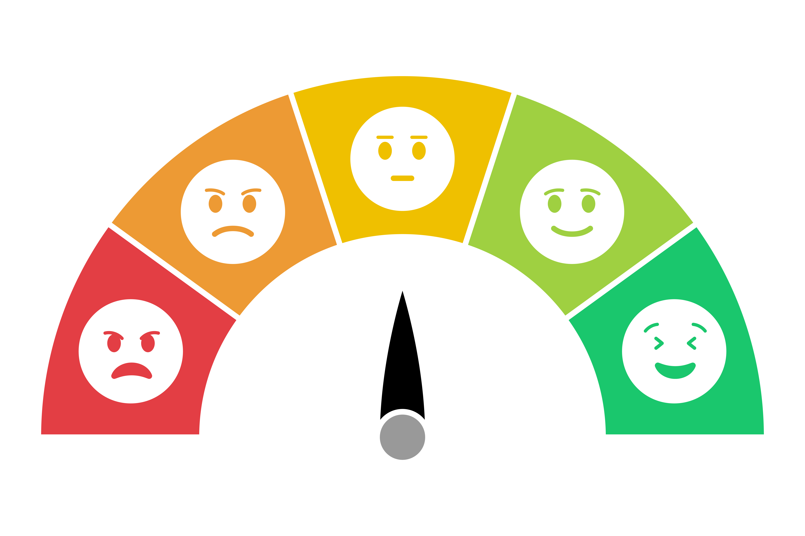
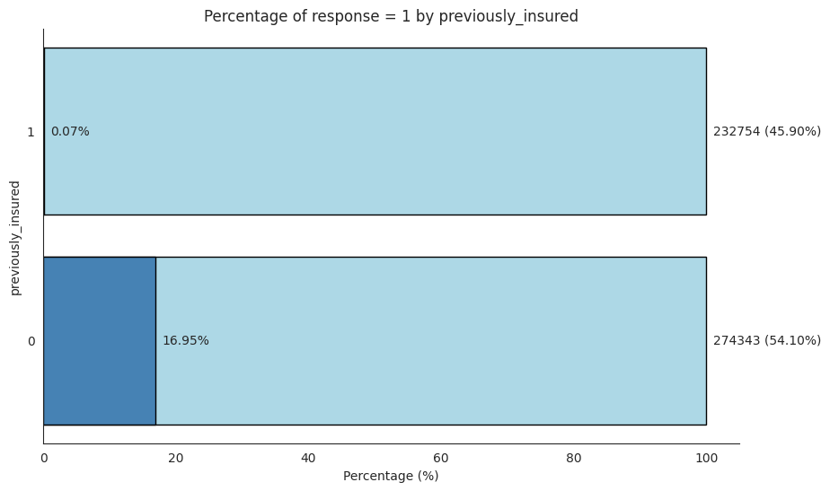
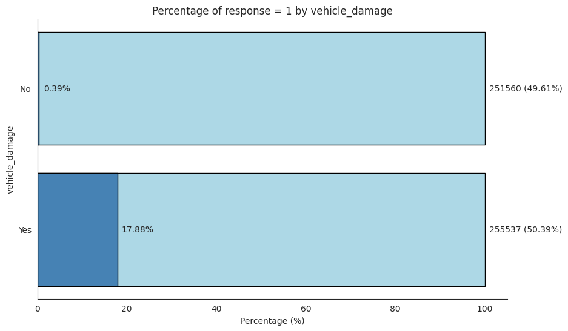
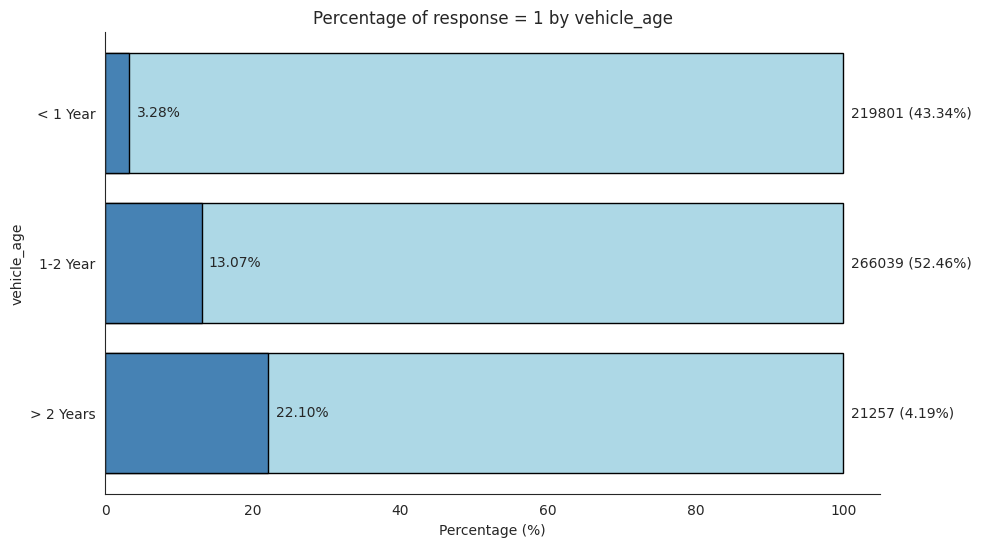
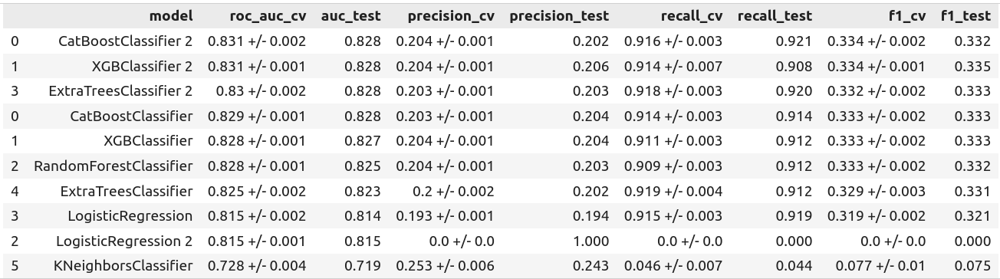
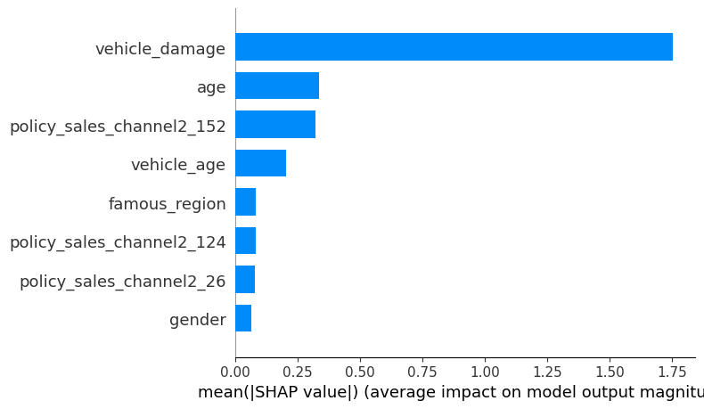
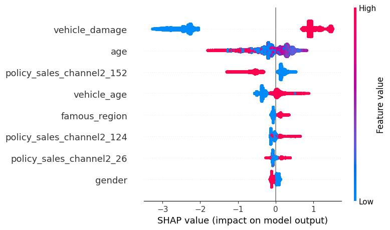
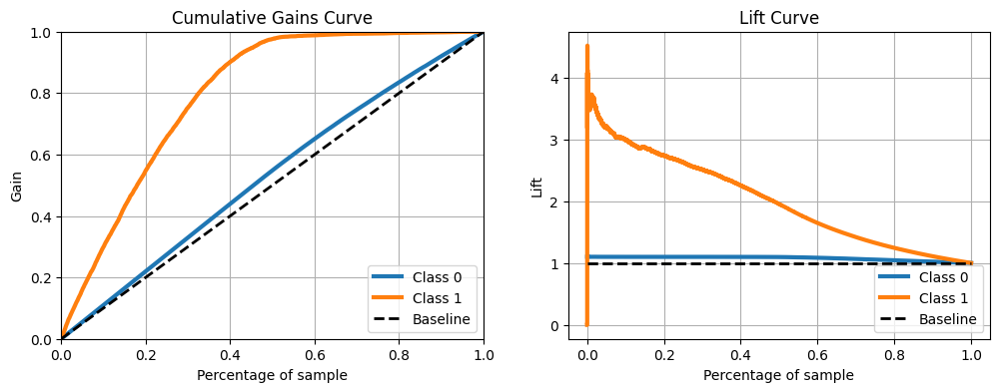
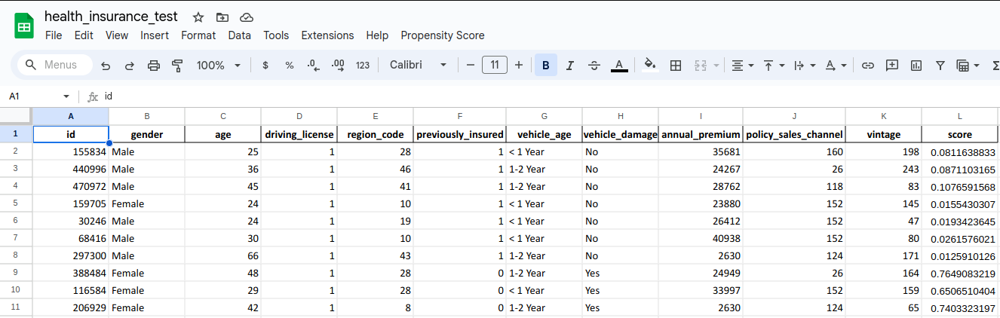

# Health Insurance Cross-Sell

## This project aims to order a potential client list by propensity score



#### This project was made by Emerson Hideki Miady.

# 1. Business Problem

Our client is an Insurance company that has provided Health Insurance to its customers now they need your help in building a model to predict whether the policyholders (customers) from past year will also be interested in Vehicle Insurance provided by the company.

An insurance policy is an arrangement by which a company undertakes to provide a guarantee of compensation for specified loss, damage, illness, or death in return for the payment of a specified premium. A premium is a sum of money that the customer needs to pay regularly to an insurance company for this guarantee.

For example, you may pay a premium of Rs. 5000 each year for a health insurance cover of Rs. 200,000/- so that if, God forbid, you fall ill and need to be hospitalised in that year, the insurance provider company will bear the cost of hospitalisation etc. for upto Rs. 200,000. Now if you are wondering how can company bear such high hospitalisation cost when it charges a premium of only Rs. 5000/-, that is where the concept of probabilities comes in picture. For example, like you, there may be 100 customers who would be paying a premium of Rs. 5000 every year, but only a few of them (say 2-3) would get hospitalised that year and not everyone. This way everyone shares the risk of everyone else.

Just like medical insurance, there is vehicle insurance where every year customer needs to pay a premium of certain amount to insurance provider company so that in case of unfortunate accident by the vehicle, the insurance provider company will provide a compensation (called ‘sum assured’) to the customer.

Building a model to predict whether a customer would be interested in Vehicle Insurance is extremely helpful for the company because it can then accordingly plan its communication strategy to reach out to those customers and optimise its business model and revenue. 

Now, in order to predict, whether the customer would be interested in Vehicle insurance, you have information about demographics (gender, age, region code type), Vehicles (Vehicle Age, Damage), Policy (Premium, sourcing channel) etc.

Problem description on Kaggle: [click here](https://www.kaggle.com/datasets/anmolkumar/health-insurance-cross-sell-prediction/data) to more information.

Note: the example has Rs. i.e. Rupee, an Indian money sign. So, the problem potentially is from an indian company.

# 2. Business Assumptions

- A crore (cr) denotes ten million and is equal to 100 lakh in the Indian numbering system. So 1 lakh is 100,000 rupees. This DataFrame I am assuming that it's from India, just because it's problem description

- The decision on the amount of health insurance to purchase should be based on a thorough evaluation of personal and family health needs, income levels, and potential future medical expenses

- For the insurance company, we have to maximize the LTV of the customers with the lowest probability of vehicle loss

# 3. Solution Strategy

- Granularity and problem type: ID classification of interested or not

- Potential solution methods: logistic regression, tree based models, KNN

- Delivery format:
    - Client prediction of interest on vehicle insurance
    - Possibility of *google sheets* to check the clients information and customize the priorization, not just by rank of customer profit

My strategy to solve this challenge was:

**Step 01. Data Description:** My goal is to use statistics metrics to identify data outside the scope of business.

**Step 02. Feature Engineering:** Derive new attributes based on the original variables to better describe the phenomenon that will be modeled.

**Step 03. Data Filtering:** Filter rows and select columns that do not contain information for modeling or that do not match the scope of the business.

**Step 04. Exploratory Data Analysis:** Explore the data to find insights and better understand the impact of variables on model learning.

**Step 05. Data Preparation:** Prepare the data so that the Machine Learning models can learn the specifc behaviour. For example, scaling and encoding are methods to this section.

**Step 06. Feature Selection:** Selection of the most significant attributes for training the model.

**Step 07. Machine Learning Modelling:** Machine Learning model training.

**Step 08. Hyperparameter Fine Tunning:** Choose the best value for each of the parameters
 of the model selected from the previous step.

**Step 09. Convert Model Performance to Business Values:** Convert the performance of the Machine Learning model into a business resut. 

**Step 10. Deploy Modelo to Production:** Publish the model in a cloud environment so that other people or services can use the results to improve the business decision.

# 4. Top 3 Data Insights

**Hypothesis 01:** If the customer already has vehicle insurance, then the customers will have more interest on the insurance of our company.



**TRUE**. If the customer already has vehicle insurance, the interest on our vehicle insurance is **lower**. So, the recomendation is to not offer our insurance to them.

**Hypothesis 02:** If the vehicle has been damaged, then the vehicle insurance interest is greater.



**TRUE.** If the vehicle has been damaged, normally people want a vehicle insurance.

**Hypothesis 03:** Customers with older vehicle have less interest on vehicle insurance.



**FALSE.** Customers with older vehicle have **more interest** on vehicle insurance. This is curious too, people with less vehicle age tend to preserve their vehicles earlier, but that's not the case.

# 5. Machine Learning Model Applied

1. I used **Boruta** with a generic Random Forest (class_weight='balanced', class_weight='balanced', max_depth=5, n_estimators=100) to select the most important features. These hyperparameters were just to avoid some overfitting and to treat imbalanced data.

**Selected features:** 'age', 'gender', 'famous_region', 'vehicle_damage', 'vehicle_age' 'policy_sales_channel2_124', 'policy_sales_channel2_152', 'policy_sales_channel2_26'

2. After feature selection, I've tried to train:
    - **CatBoost**
    - **XGBoost**
    - **Random Forest**
    - **Logistic Regression**
    - **Extra Trees**
    - **KNN**

3. To maximize the results, I've tunned the hyperparameters for almost all of the models, **only not for KNN**, which had a poor performance, **and not for Random Forest**, which was too slow.

# 6. Machine Learning Modelo Performance

The second version of the models corresponds to the models already tunned.



So, the chosen one was CatBoost Tunned, with the following hyperparameters:

```
- 'iterations': 311, 
- 'depth': 6, 
- 'learning_rate': 0.04772516436776049, 
- 'random_strength': 8.35660360558705, 
- 'l2_leaf_reg': 51.72660544188361, 
- 'subsample': 0.7852968586384578, 
- 'colsample_bylevel': 0.6713810602285384, 
- 'min_data_in_leaf': 54,
- 'auto_class_weights':'Balanced',
- 'early_stopping_rounds':50,
- 'logging_level':'Silent',
- 'random_state':42
```

- Feature importance - mean of |SHAP| of the best model:



- Beeswarm SHAP:



# 7. Business Results

## 7.1. Cumulative Gain and Lift Curves


**CUMULATIVE GAIN CURVE TRANSLATE**
1. If we contact to **20\%** of all the sample, then we can get almost **60\%** of interest in vehicle insurance
2. If we contact to **40\%** of all the sample, then we can get almost **90\%** of interest in vehicle insurance

**LIFT CURVE TRANSLATE**
1. If we contact to **20\%** of all the sample, then we can convert almost **3 times more** than an aleatory model
2. If we contact to **40\%** of all the sample, then we can convert almost **2.5 times more** than an aleatory model

## 7.2. Precision and Recall at K

- **Precision at k: 33.37\%**
- **Recall at k: 3.58\%**

If we contact to 1,000 customers, we can get **334 interested in vehicle insurance**. This number, 334, corresponds to **3.58\%** of all interested in our database.

## 7.3. Vehicle insurance annual amount estimation

What about vehicle insurance annual amount if we use the model to contact the first 1k customers?

Some things that we have to consider:
- If the customer doesn't have health insurance, maybe he can get the vehicle insurance anyway. Health insurance features weren't important for the model
- If the customer already has had vehicle damaged, then he is more likely to get interested in vehicle insurance BUT he is dangerous for the company at the same time, because he would be risky and get vehicle damaged again...
- If the customer doesn't have driving license, then ignore the vehicle insurance offer

Maybe a rule to pricing the vehicle insurance for each customer is:
- If the **customer has driving license and has had vehicle damaged**, then offer **20\%** of the annual premium price
- If the **customer has driving license but he doesn't have had vehicle damaged**, then offer **10\%** of the annual premium price
- If the **customer doesn't have driving license**, **don't offer to him**

**NOTES:** 
- It is just a suggestion of pricing, ideally we need a risk pricing analysis of each client and price them
- Our premise is that we don't have any vehicle damage expenses in all the year

**ANSWER:**

Amount for the first **1,000** contact: **Rs. 2,615,922.4**

## 7.4. Model Production in Google Sheets

I used Apps Script from Google Sheets to put propensity score automatically. It is so easy for the stakeholders, just click on Propensity Score and observe the magic:



# 8. Conclusions

The best model can select well the most propensity customers of health insurance, but one important thing that we have to consider:

```
Cross-sell of vehicle insurance and health insurance aren't correlated, so we can sell vehicle insurance separately! This is a good business question to think in the future.
```

I afirm this because when we look at the feature selection, no one variable related to health insurance was selected, so this fact doesn't impact on vehicle insurance selling.

And maybe, if the company wants to use this model to sell vehicle insurance separately, the propensity score is valid! Obviously we can improve with more other features, but that's it!

# 9. Lessons Learned

- Lift and Cumulative curves are the best approaches to handle propensity models

- Precision and Recall at K are good metrics to a business view for this problem

- Maybe cross-sell isn't the best method to improve the company profit

- I learned how to put a model into production and use Apps Script from Google Sheets

# 10. Next Steps to Improve

- Build some presentation in PPT to show the results and conclusions for the stakeholders

- Edit the `HealthInsuranceCSAppsScript.js` to be more automatic, like, if we add one column in the spreadsheet, now we have to edit manually the code...

- Build a model monitoring and stay aware when the model will need to be retrained

# LICENSE

# All Rights Reserved - Comunidade DS 2021
